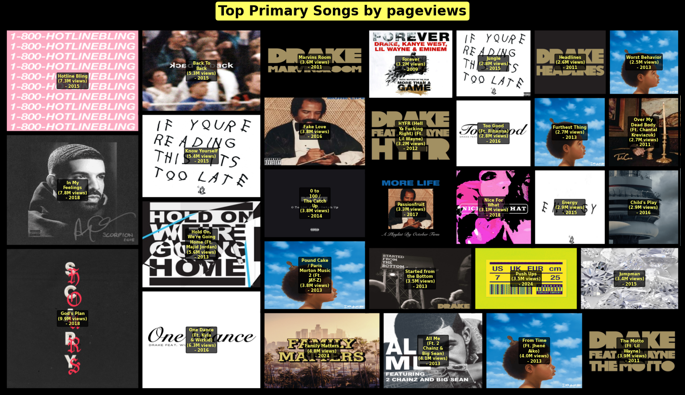

# Genius Artist Statistical Analysis 

This repo is me turning my **`Drake` obsession since 2009** into a data science project — or at least making it look academic so people don’t just call it “copium.”  
Basically, I pulled **"Drizzy"’s catalog** through the `Genius` API, ran it through Python, and tried to answer the timeless question: *“Why does this man drop so much music, and how does the internet actually react to it?”*  

From **"Take Care" tears** to **"Her Loss" debates**, from “Started From the Bottom” to “Laugh Now Cry Later,” this dataset is thick with highs, lows, collabs and tracks that should’ve stayed in the vault.  

## What is `Genius`  ? 🤔  
- `Genius` is basically **Wikipedia for lyrics, with clout.**  
- You get lyrics, annotations, context and (more importantly for me) **pageviews = clout score.**  
- Why `Genius`? Because it shows which songs people are actually googling lyrics for, not just passively streaming on Spotify. It’s not just about plays, it’s about cultural impact.  

## Why `Drake`  ? 🦉  
- Been listening since **2009-2010**, back when “Best I Ever Had” had me feeling things in high school I shouldn’t have.  
- `Drake` is basically a case study in **music as a content strategy**:  
  - Drops solo albums like seasonal DLC packs.  
  - Collabs everywhere: Future, 21 Savage, Rihanna, Travis, Central Cee…  
  - Undefeated at meme-ification (yes, Hotline Bling, I’m looking at you).  
- His catalog = **dense data goldmine**. Plenty of ups, downs, and “what even is this?” moments.  

## Project information  
- **Conducted by**: Tai Nguyen *(tainguyen0604@gmail.com)*  
- **Period**: Aug 31st 2025 – Sep 07th 2025 *(straight outta Genius API vault, timestamps patched into UTC+7)*  
- **Contribution Breakdown**:    

| Source             | Description                                                                                     | %   |  
|--------------------|-------------------------------------------------------------------------------------------------|-----|  
| Self-conducted     | Cleaning messy JSON, building DataFrames, visualizing clout charts (aka “`Drake` stock market”)   | 70% |  
| AI-assisted        | Helping with API crawling, annotation parsing, avoiding regex-induced burnout                   | 25% |  
| Random Googling    | “How many albums does `Drake` actually have?” / “Why is `Genius` API rate limit so petty?”          | 5%  |  

> ***Behind the scenes**: `Genius` API is stingy. You’d think `Drake`’s catalog is a national secret with how slow it gives data.*  

## Project Objectives 
1. **Timeline analysis** → Map `Drake`’s career across years, highlight peaks & flops.  
2. **Collab breakdown** → Featured vs. Featuring vs. Co-Primary — who actually helps "Drizzy" win?  
3. **Hot vs. Not** → Why do some songs blow up on `Genius` (lyrical hooks, meme moments) but flop on streaming, and vice versa?  
4. **Album autopsy** → Compare fan reception between *What a Time to Be Alive* vs. *Her Loss* vs. *Certified Lover Boy*, etc.  
5. **Cultural impact** → Where the `Genius` pageviews tell a different story than Billboard charts.  

## Tools Used  
- **Python**: `pandas`,`datetime`,`matplotlib`,`seaborn`,`numpy`,`os`,`json`,`zoneinfo`,`requests`,`re`,`urllib`,`PIL`,`calmap`,`wordcloud`,`squarify`,`api_key`,`importlib`
- **Jupyter Notebook** (the lab notebook of digital overthinkers)  
- **`Genius` API** (lyrics + metadata + pageview counts = the holy trinity)  

## Notes
- Co-primary projects with **Future** still print numbers like an ATM — *What a Time to Be Alive* (2015) basically carried the tag-team legacy.  
- Collabs with **J. Cole** often read like lyrical dissertations — tons of annotations, but pageviews stay modest (bars don’t always translate to clout).  
- **Kendrick** features are rare, and maybe that’s the point — when they happen, the culture debates more than the `Genius` clicks do.  
- With **Lil Wayne**, early co-sign tracks put `Drake` on the map, but data shows people aren’t exactly revisiting them on `Genius` anymore (nostalgia ≠ traffic).  
- Bottom line: not every “legendary collab” equals lyric lookups — the `Genius` audience picks its battles differently than the charts.  

## Contents 
- `notebooks/genius-artist-statistic-2025-08-31.ipynb`: the real grind  
- `outputs/images/`: thumbnails, treemaps, clout charts  
- `requirements.txt`: dependencies + coping mechanisms  
- `README.md`: this file (oversharing with stats)  
- `data/`: raw JSONs from Genius API + cleaned Excel DataFrames (aka receipts of my obsession)  
- `data/data_dictionary.md`: a cheat sheet explaining every column, so future-me doesn’t rage quit trying to remember what `release_date_with_abbreviated_month_for_display` or `annotation_count` meant  

## Closing Thoughts 💡  
- `Drake` might be **“Too Good”** at gaming the music industry, but data shows some collabs don’t always hit like the memes promised. `Genius` reminds us: clout ≠ streams, and streams ≠ lyrics worth googling.  

---

> *“Started from the JSON now we here.”*  
> *“`Drake`’s collabs are like my exes — some unforgettable, some I’d rather delete from history.”*  
> *“Some `Drake` eras were ‘God’s Plan’, others were just God testing me.”*  
> *“`Genius` pageviews = the real Billboard.”*  
