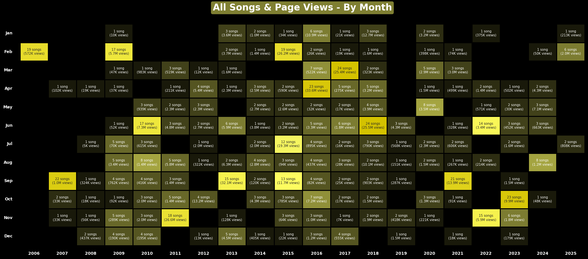
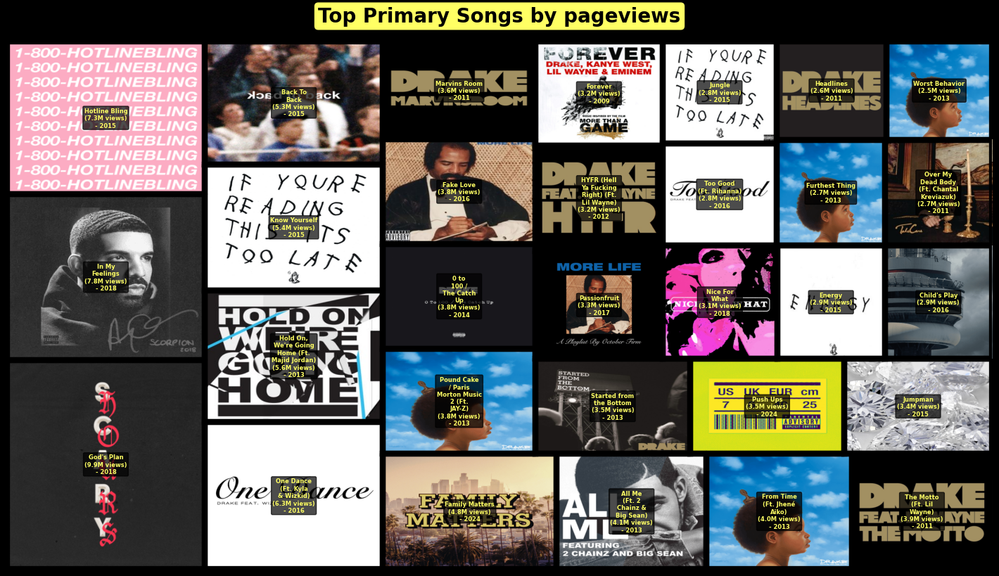
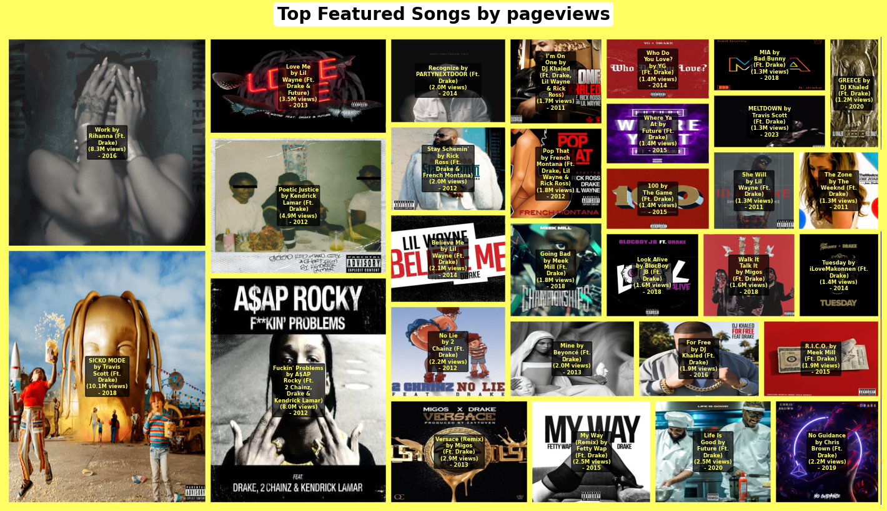
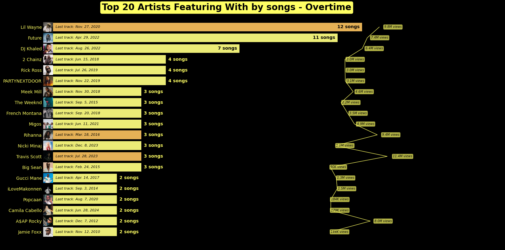
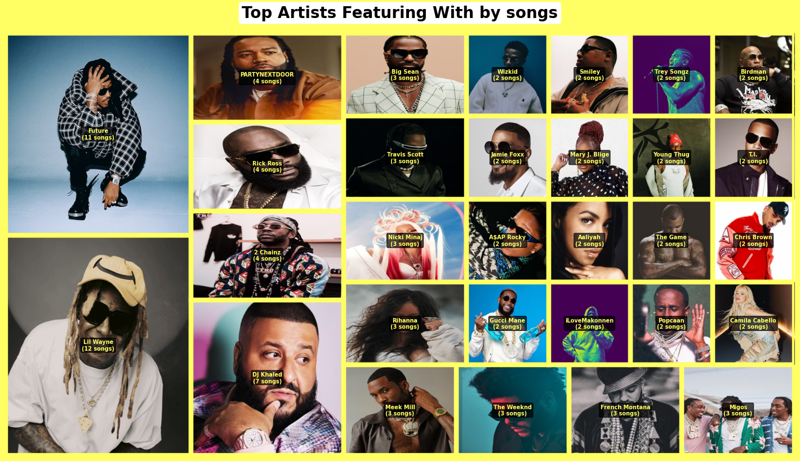

# **GENIUS ARTIST STATISTICAL ANALYSIS**

# Introduction  
### About **Genius** 
>Founded back in 2009 (originally as `Rap Genius`), `Genius` started as a crowd-sourced platform for annotating and breaking down rap lyrics.
Think of it as Wikipedia, but for "bars" and "punchlines" — people could finally decode what *Lil Wayne* meant without starting a Reddit war.
>
>
>
>Over the years, `Genius` has evolved into one of the largest music knowledge hubs online, expanding far beyond *hip-hop* into *pop*, *rock*, *R&B* and pretty much every genre that charts.  
>Today, `Genius` isn’t just about lyrics anymore. 
It hosts artist interviews, behind-the-scenes production notes, music stats, and even embeds into *Spotify/Apple Music* so you can read lyrics while pretending you know them by heart.  
>**In short**: it’s a massive open archive that tracks not only songs but also the cultural footprint they leave behind.  
>
>**Some quick numbers to flex:**
>- **Founded:** 2009  
>- **Initial focus:** Rap lyrics & annotations  
>- **Now:** 30M+ songs across genres, millions of annotations & pageviews  
>- **Impact:** A go-to platform for fans, analysts and artists alike  
>
>Basically, `Genius` = *Google* for lyrics, but with a community that occasionally roasts you for misunderstanding a metaphor.  

### About **This Analysis**
>For this little data adventure, I’m pulling data straight from the Genius API. The focus? **`Drake`**!  
>
>
>
>Why **`Drake`**? Because I’ve been listening to him since his early breakout days around 2009–2010, and let’s be real — the man has been **consistently dropping music like Spotify pays him rent.**
>With a catalog that spans over a decade, `Drake`’s discography is dense enough to provide a solid dataset for statistical analysis.  
>
>**What I’ll Be Looking At**:  
>- **Timeline:** How `Drake`’s songs have stacked up year after year  
>- **Popularity:** Which tracks are getting the most pageviews on `Genius`  
>- **Song Categories:**    
>    1. Songs where `Drake` is the Primary Artist  
>    2. Songs where `Drake` is a Featured Artist  
>    3. Songs where `Drake` is a Co-Primary Artist (collaborations with equal billing)  
> - **Artist Collaborations:**  
>    1. Artists Featured by `Drake` (other artists = featured artist)  
>    2. Artists that `Drake` Features With (other artists = primary artist)  
>
> **In short**: this analysis will be less about “is `Drake` the GOAT?” (that’s for *Twitter* debates) and more about **how his output and visibility have evolved over time**, using `Genius` data as the evidence.  
>
>So buckle up — because if there’s one thing we know about `Drake`, it’s that he never runs out of verses… or data points. 🦉  

# **0. Table of contents**
- I. Import Library
- II. Prepared functions
- III. Import ARTISTs' SONGs
  - III.1. Get API KEY
  - III.2. Get & save ARTISTs' SONGs JSON
  - III.3. Import saved JSON and create dataframe of ARTISTs' SONGs
  - III.4. Data cleansing for ARTISTs' SONGs
  - III.5. Save ARTISTs' SONGs
  - III.6. Describe ARTISTs' SONGs
- IV. Import THUMBNAILs
  - IV.1. Download primary artist's THUMBNAILs
  - IV.2. Download featured artist's THUMBNAILs
  - IV.3. Download songs' THUMBNAILs
- V. Merge ARTISTs SONGs & THUMBNAILs
  - V.+ Save ARTISTs' SONGs with THUMBNAILs
- VI. Format Datetime
- VII. ALL SONGs
  - VII.1. All songs - BY YEAR
  - VII.2. All songs - BY MONTH
    - VII.2.1. All songs - BY MONTH
    - VII.2.2. Top all songs by pageviews - BY MONTH
    - VII.2.3. [THUMBNAIL] Top all songs by pageviews - BY MONTH
  - VII.3. TOP ALL SONGs by Pageview - OVERTIME
    - VII.3.1. Top 20 All Songs by Pageview
    - VII.3.2. [WORDCLOUD] Top All Songs by Pageview
    - VII.3.3. [TREEMAP] Top All Songs by Pageview
  - VII.4. TOP ALL SONGs by ANNOTATIONs - OVERTIME
- VIII. SONGs as PRIMARY ARTIST
  - VIII.1. Songs as primary artist - BY YEAR
  - VIII.2. Songs as primary artist - BY MONTH
    - VIII.2.1 Songs as primary artist - BY MONTH
    - VIII.2.2. Top songs as primary artist by pageviews - BY MONTH
    - VIII.2.3. [THUMBNAIL] Top songs as primary artist by pageviews - BY MONTH
  - VIII.3. TOP SONGs as primary artist by Pageview - OVERTIME
    - VIII.3.1. Top 20 Songs as primary artist by Pageview
    - VIII.3.2. [WORDCLOUD] Top Songs as primary artist by Pageview
    - VIII.3.3. [TREEMAP] Top Songs as primary artist by Pageview
  - VIII.4. TOP SONGs as primary artist by ANNOTATIONs - OVERTIME
- IX. SONGs as FEATURED ARTIST
  - IX.1. Songs as featured artist - BY YEAR
  - IX.2. Songs as featured artist - BY MONTH
    - IX.2.1. Songs as featured artist - BY MONTH
    - IX.2.2. Top Songs as featured artist by pageviews - BY MONTH
    - IX.2.3. [THUMBNAIL] Top Songs as featured artist by pageviews - BY MONTH
  - IX.3. TOP SONGs as featured artist by Pageview - OVERTIME
    - IX.3.1. Top 20 Songs as featured artist by Pageview
    - IX.3.2. [WORDCLOUD] Top Songs as feature artist by Pageview
    - IX.3.3. [TREEMAP] Top Songs as featured artist by Pageview
  - IX.4. TOP SONGs as featured artist by ANNOTATIONs - OVERTIME
- X. FEATURED ARTISTs (primary songs)
  - X.1. Featured artists - BY YEAR
  - X.2. Featured artists - BY MONTH
    - X.2.1. Featured artists - BY MONTH
    - X.2.2. Top featured artists by pageviews - BY MONTH
    - X.2.3. [THUMBNAIL] Featured artitst by pageviews - BY MONTH
  - X.3. TOP FEATURED ARTISTs by Pageview - OVERTIME
    - X.3.1. Top 20 Featured Artists by Songs
    - X.3.2. [WORDCLOUD] Top Featured Artists by Songs
    - X.3.3. [TREEMAP] Top Featured Artists by Songs
  - X.4. TOP SONG of each TOP FEATURED ARTISTs by Pageview - OVERTIME
- XI. ARTISTs FEATURING WITH
  - XI.1. Artists featuring with - BY YEAR
  - XI.2. Artists featuring with - BY MONTH
    - XI.2.1. Artists featuring with - BY MONTH
    - XI.2.2. Top artists featuring with by pageviews - BY MONTH
    - XI.2.3. [THUMBNAIL] Top artists featuring with by pageviews - BY MONTH
  - XI.3. TOP ARTISTs FEATURING WITH by Pageview - OVERTIME
    - XI.3.1. Top 20 Artists Featuring With by Songs
    - XI.3.2. [WORDCLOUD] Top 20 Artists Featuring With by Songs
    - XI.3.3. [TREEMAP] Top 20 Artists Featuring With by Songs
  - XI.4. TOP SONG of each TOP ARTISTs FEATURING WITH by Pageview - OVERTIME
- XII. SONGs as CO-PRIMARY ARTIST
  - XII.1. Songs as co-primary artist - BY YEAR
  - XII.2. Songs as co-primary artist by Pageview - OVERTIME
    - XII.2.1. All Songs as co-primary artist by Pageview
    - XII.2.2. [TREEMAP] All Songs as co-primary artist by Pageview
- SUMMARY
- THE END

### **I. Import Library**
### **II. Prepared functions**
# **III. Import ARTISTs' SONGs**
#### **III.1. Get API KEY**
## **III.2. Get & save ARTISTs' SONGs JSON**

> ###  We begin by collecting data from the `Genius` API: [https://api.genius.com](https://api.genius.com).  
> 1. The process starts with the *"/search"* endpoint, which allows us to look up an artist and retrieve their *artist_id* (in this case, `Drake`). Once we have the *artist_id*, we use the *"/artists/{artist_id}/songs"* endpoint to fetch the full list of songs associated with that artist.  
> 2. Since the catalog is large, the results are paginated — each page returns up to 50 songs. To cover the entire dataset, we loop through all available pages and store the responses. The API responses come in JSON format, which we then save locally to avoid making repeated API calls during analysis.  
> 3. For `Drake`, the "*artist_id*" returned is **130**, and the full dataset spans **39 pages** of JSON files. While most pages should contain 50 tracks, some only return 43–47 songs due to API limitations or inconsistencies. Despite these gaps, the dataset still covers roughly **95% of `Drake`’s complete catalog** on `Genius`, which is sufficient for statistical analysis.  

## **III.3. Import saved JSON and create dataframe of ARTISTs' SONGs**

> ### Next, we import the saved JSON file and transform it into a dataframe.  
> - The resulting dataframe contains **1,787 rows** and **41 columns**.  
> - Column types include: **3 boolean**, **8 float64**, **5 int64** and **25 object**.  

## **III.4. Data cleansing for ARTISTs' SONGs**

> ### We then move on to data cleansing, ensuring the dataset is accurate and usable.  
> 1. This involves **filling missing values** for both numeric and object fields, **converting date fields** into proper datetime format and **removing songs not directly tied to `Drake`** *(such as covers, samples or simple references)*. We also **filter out tracks with zero pageviews** — often *fan uploads, unofficial remixes or non-canonical releases* — and finally **sort the records by the most recent release date**.  
> 2. After cleansing, the dataset shrinks from **1,787 rows** to **782 rows**, representing songs that `Drake` actually contributed to. One key column, `release_date_for_display`, still has **124 missing values** since some entries only provide a release year without full month/day information.  
> 3. In other words, only about **44% of the raw dataset** turned out to be relevant to `Drake`’s real discography — the rest was noise we had to clean out.  

#### **III.5. Save ARTISTs' SONGs**

## **III.6. Describe ARTISTs' SONGs**

> ### At this stage, we review the dataset’s key statistics to capture its overall shape and distribution.  
> 1. Song timeline spans **2006–2025**, covering early releases and upcoming tracks.  
> 2. **Pageviews** show a long-tail pattern: from **5K** up to **10M**, median around **187K**.  
> 3. **Annotation counts** are generally low (median = 9), suggesting most songs don’t have extensive lyric breakdowns, while only a few tracks attract heavy annotation activity.  
> 4. **The primary artist IQ** varies dramatically (0–67K), meaning some collaborations involve artists with very different `Genius` profiles.  
> 5. `Lil Wayne` is the top collaborator (12 features), reflecting their strong partnership.  
>
> ➡️➡️ **Drake**’s **Genius** presence is massive and consistent, but popularity is skewed toward a handful of blockbusters, while most songs sit in the mid-to-low engagement range. Collaborations, especially with `Lil Wayne`, form a significant part of his discography footprint.  

### **IV. Import THUMBNAILs**

### **V. Merge ARTISTs SONGs & THUMBNAILs**

### **VI. Format Datetime**

# **VII. ALL SONGs**
## **VII.1. All songs - BY YEAR**

> ### Now, we visualize **all tracks involving `Drake` over time**, mapping out his presence and popularity via `Genius` pageviews.  
> 1. `Drake`’s earliest listed song dates back to **2006**, already recording around **1.0M** pageviews—an early sign of rising attention.  
> 2. By **2009**, his career picks up steam with around **45 songs**, highlighted by the collab **“Forever”** with *Eminem, Kanye West and Lil Wayne*, which jointly amassed **10M** views.  
> 3. **2011** marks a breakout moment: **“The Motto”** (featuring *Lil Wayne*) goes viral—with **3.9M** views on `Genius` , its cultural impact (inventing YOLO, Grammy nods) implies massive engagement.  
> 4. In **2013**, during the **"Nothing Was the Same"** era, **“Hold On, We’re Going Home”** (with *Majid Jordan*) contributes to a cumulative **60M** views for the year.  
> 5. From **2015–2018**, `Drake` dominates:  
>    - **2015** — **Views** era, “**Hotline Bling**” becomes legendary (huge chart success, awards); total views **64M**, with **Hotline Bling** as a top driver.  
>    - **2016** — “**Work**” (with Rihanna) rakes in **8.3M**, adding to an annual total of **59M**.  
>    - **2017** — **More Life** era, hits like **“Passionfruit”** (3.3M) sustain strong momentum.  
>    - **2018** — **Scorpion** era peaks, but the top view-getter is a feature: **“Sicko Mode”** (with *Travis Scott*) **10M**, annual total **62M**.  
> 6. The period **2019–2021** sees a slowdown: `Drake` leans into emotional, love-centric projects (**Dark Lane Demo Tapes**, **Certified Lover Boy**), still streaming big, but `Genius` lyric view counts dip significantly.  
> 7. **2022–2023** mark a thematic return: heavy-hitting albums (**Her Loss** with *21 Savage*, **For All the Dogs**) deliver hits like “**Rich Flex**” (1.4M) and “**Slime You Out**” (1.8M), though overall lyric pageviews remain modest—suggesting a shift toward commercial vibes over lyric-driven buzz.  
> 8. In **2024**, `Drake` clashes with *Kendrick Lamar* in a highly public beef. His most-viewed lyrics that year are diss tracks—**“Family Matters”** (4.8M)—reflecting high fan engagement with lyric breakdowns in the conflict context.  
> 9. So far in **2025**, activity is minimal: only **9 songs** released in the first 8 months, with the top lyric view being **“NOKIA”** (900K).  
>
> ➡️➡️ `Drake`’s `Genius` traction peaks during culturally monumental eras, particularly between 2015–2018, while his more emotional or commercial phases garner less lyric engagement—suggesting that, at least on `Genius`, fans gravitate toward his most iconic, high-stakes moments.  

## **VII.2. All songs - BY MONTH**
### **VII.2.1. All songs - BY MONTH**

> ### Next, we examine the **monthly release pattern** of all songs involving `Drake`, including both solo work and collaborations.  
> 1. Over nearly 02 decades, `Drake` has consistently released music across most months, showing a steady presence in the industry.  
> 2. Bright yellow clusters in the visualization align with **album and mixtape drops**, when releases peak. This matches his prolific catalog of **08 studio albums and 07 mixtapes** to date.  
> 3. The recent slowdown in monthly activity reflects the aftermath of his high-profile beef with *Kendrick Lamar*. Still, given his historical pattern of rebounds, it’s likely `Drake` will return with another major project—album or mixtape—in the near future.  
>
> ➡️➡️ `Drake`’s release cadence is highly cyclical—quiet stretches are followed by intense bursts of output tied to new projects, reinforcing his ability to stay culturally relevant over time.  
> Compared to peers like **Future**, known for flooding the market with mixtapes, or **Kanye West**, who favors fewer but highly eventized drops, `Drake`’s strategy blends both consistency and spectacle—balancing constant presence with headline-making releases.  
>
> ***Prediction**: Don’t be shocked if `Drake` shows up with a “revenge album”, turning beef into bangers—basically speedrunning his way from “Certified Lover Boy” back to “Certified Chart Topper.”*  

### **VII.2.2. Top all songs by pageviews - BY MONTH**

> ### This visualization highlights `Drake`’s catalog over time, showing his monthly hits and its pageviews on `Genius`.  
> 1. Peaks in yellow mark his biggest hits, such as **Forever** (3.2M), **The Motto** (9.3M), **Hotline Bling** (7.3M), **One Dance** (6.3M), **In My Feelings** (7.8M) and the *Travis Scott* collab **Sicko Mode** (10.1M).  
> 2. More recent standouts include **Family Matters** (4.8M) during his 2024 beef with *Kendrick Lamar*, illustrating how cultural moments also drive lyric engagement.  

### **VII.2.3. [THUMBNAIL] Top all songs by pageviews - BY MONTH**

> ### The chart above takes the same monthly data and flips it into a visual timeline, where each box represents a `Drake` hit across the years.  

## **VII.3. TOP ALL SONGs by Pageview - OVER TIME**
### **VII.3.1. Top 20 All Songs by Pageview**

> ### This visualization highlights the **Top 20 most viewed `Drake`-related tracks on `Genius` over time**, combining solo hits and major collaborations.  
> 1. Interestingly, **around half of the songs are features** where `Drake` is not the primary artist (e.g. *Travis Scott*’s **Sicko Mode**, *Rihanna*’s **Work**, *A$AP Rocky*’s **Fuckin’ Problems**). This suggests that `Drake`’s dominance leans more on **streaming success and mass appeal** rather than deep lyric analysis — a hallmark of a commercial superstar versus a technical lyricist.  
> 2. The chart also shows a **clear gap in recent years**: aside from **Family Matters** (2024), a diss track against *Kendrick Lamar* with 113 annotations, none of the top 20 come from the past 5 years. This could reflect a shift in `Drake`’s artistry — moving toward **catchy, rhythm-driven hits** while stepping away from lyrically dense material that sparks annotations.  
> 3. Annotation counts are modest (*often 30–50*), indicating limited lyrical depth compared to rap peers. Meanwhile, the songs that did amass significant `Genius` engagement (>1,000 pyongs) are **a decade old**, underscoring that `Drake`’s **peak lyrical relevance may be behind him**, aligning with `Kendrick`’s critique that `Drake` is prioritizing profitability over rap craftsmanship.  

### **VII.3.2. [WORDCLOUD] Top All Songs by Pageview**
> ### Below is a **word cloud visualization** of the most viewed `Drake`-related tracks on `Genius`, where larger words represent higher pageviews.
> This format makes it easy to spot which collaborations and solo hits dominate audience attention.  

### **VII.3.3. [TREEMAP] Top All Songs by Pageview**
> ### Below is a **thumbnail tree map visualization** showcasing the top-viewed `Drake` songs on `Genius`.
> Each block’s size reflects its relative popularity, while the album artwork provides quick visual context for the track.  

## **VII.4. TOP ALL SONGs by ANNOTATIONs - OVER TIME**
> ### Here is a **visualization of the top `Drake` tracks ranked by annotation count** on `Genius`,
> highlighting the songs that sparked the most lyrical discussion and interpretation within the community.  

# **VIII. SONGs as PRIMARY ARTIST**
## **VIII.1. Songs as primary artist - BY YEAR**

> ### This visualization shows the **number of songs where `Drake` is listed as the primary artist across different years**, reflecting a consistent output over time.  
> - The overall insights remain aligned with earlier observations: `Drake` has maintained a steady release pattern, with peak periods often tied to album or mixtape drops.  
> - Notable high-view tracks that stand out include:  
>    - 2012: **HYFR (Hell Ya Fucking Right)(Ft. Lil Wayne)** from *Take Care* – **3.2M views**  
>    - 2014: **0 to 100 / The Catch Up** from *Nothing Was the Same* – **3.8M views**  
>    - 2016: **One Dance (Ft. Kyla & Wizkid)** from *Views* – **6.3M views**  
>    - 2018: **God’s Plan** from *Scorpion* – **9.9M views** *(`Drake`’s most-viewed solo track on `Genius`)*  
>    - 2020: **Chicago Freestyle (with GIVĒON)** from *Dark Lane Demo Tapes* – **1.8M views**  
> - These milestones highlight how `Drake`’s **biggest `Genius` pageview spikes** often align with his major album cycles, underscoring his dominance in both streaming popularity and cultural presence.  

## **VIII.2. Songs as primary artist - BY MONTH**
### **VIII.2.1 Songs as primary artist - BY MONTH**

### **VIII.2.2. Top songs as primary artist by pageviews - BY MONTH**

> ### This chart showcases **`Drake`’s top primary songs by pageviews on `Genius`, mapped by release month and year**.  
> 1. Notable high-view tracks that stand out include:  
>    - **Marvins Room** – *Jun 2011* (3.6M views)  
>    - **Started From The Bottom** – *Feb 2013* (3.5M views)  
>    - **All Me (Ft. 2 Chainz & Big Sean)** – *Sep 2013* (4.1M views)  
>    - **Know Yourself** – *Feb 2015* (5.4M views)  
>    - **Fake Love** – *Oct 2016* (3.8M views)  
>    - **Nice For What** – *Apr 2018* (3.1M views)  
>    - **In My Feelings** – *Jun 2018* (7.8M views)  
>    - **Push Up** – *Apr 2024* (4.8M views, a diss track during his feud with *Kendrick Lamar*)  
> 2. A clear **pattern emerges**:  
>      - Between **2010–2018**, `Drake` consistently released high-impact primary tracks, many aligned with major album drops (*Take Care*, *Nothing Was the Same*, *Views*, *Scorpion*).  
>      - In the **last 05 years**, although the *overall number of `Drake`-related songs* remains high, his **output as a primary artist has slowed**.  
>      - This suggests a shift toward **features and collaborations**, while still maintaining steady album/mixtape releases to anchor his discography.  
>
> ➡️➡️ The trend reflects `Drake`’s evolution from being a **lyric-driven chart staple** to a **strategic collaborator**, reinforcing his dominance across streaming platforms while diversifying his presence.  

### **VIII.2.3. [THUMBNAIL] Top songs as primary artist by pageviews - BY MONTH**
> ### We have a visualization of **`Drake`’s top primary songs by pageviews on `Genius`**, presented as a **thumbnail chart**.  

## **VIII.3. TOP SONGs as primary artist by Pageview - OVER TIME**
### **VIII.3.1. Top 20 Songs as primary artist by Pageview**

> ### Next is the visualization of **`Drake`’s Top 20 songs as a primary artist** ranked by `Genius` pageviews.
> 1. Most tracks attract **moderate annotation activity**, showing listeners engage less with deep lyric breakdowns compared to streams.  
> 2. A few standout songs earned higher annotation counts, reflecting lyrical depth and rap craftsmanship:  
>    + **Know Yourself** (2015, *If You're Reading This It’s Too Late*) → **56 annots, 5.4M views**  
>    + **Pound Cake / Paris Morton Music 2** (2013, *Nothing Was the Same*) → **55 annots, 3.8M views**  
>    + **Push Ups** (2024, a diss track during his feud with *Kendrick Lamar*) → **50 annots, 3.5M views**  
>
> These exceptions highlight that while `Drake`’s commercial hits dominate in views, only select tracks spark strong analytical discussions on `Genius`.  

### **VIII.3.2. [WORDCLOUD] Top Songs as primary artist by Pageview**
> ### The following visualization shows **`Drake`’s top songs as a primary artist** on `Genius` by pageviews, displayed in a **Word Cloud**.
> Larger words represent tracks with higher view counts, offering a quick snapshot of his most recognized hits.  

### **VIII.3.3. [TREEMAP] Top Songs as primary artist by Pageview**
> ### The next visualization presents the **same top songs** in a **thumbnail Tree Map**,
> where each block’s size reflects pageview volume and album artwork provides additional context.   
> This format highlights both popularity and visual identity across `Drake`’s catalog.  

## **VIII.4. TOP SONGs as primary artist by ANNOTATIONs - OVER TIME**

> ### The following visualization highlights **`Drake`’s top songs as a primary artist ranked by annotations on `Genius`**.
> These tracks often stand out for their lyrical depth and technical craft rather than mainstream popularity.  
> 1. Beyond the previously discussed songs, several others also rank high in annotations:  
>    + **No Tellin’** (2015, *If You’re Reading This It’s Too Late*) — 75 annots, 1.1M views.  
>    + **8am in Charlotte** (2023, *For All the Dogs*) — 60 annots, 700k views.  
>    + **7am on Bridle Path** (2021, *Certified Lover Boy*) — 57 annots, 800k views.  
>    + **Know Yourself** (2015, *If You’re Reading This It’s Too Late*) — 56 annots, 5.4 views.  
> 2. Interestingly, while these tracks receive **high annotation activity**, they attract **very low pyong counts** (only a few up to ~200). The exception is **Know Yourself** with over 1.1k pyongs, resonating strongly due to its **self-discovery theme**.  
> 3. This gap between **annotations and pyongs** suggests that fans engage deeply with `Drake`’s lyrical complexity, but mass appreciation tends to gravitate toward more **accessible, commercial hits**.  
> 4. Compared to peers like *Kendrick Lamar*, whose tracks often achieve both **high annotations and strong pyong counts**, `Drake`’s lyrical works show deep fan engagement but lack the same **broad critical acclaim and community endorsement**.  

# **IX. SONGs as FEATURED ARTIST**
## **IX.1. Songs as featured artist - BY YEAR**

> ### Next, we look at the songs where `Drake` is featured alongside other primary artists.
> Over time, the volume of features has gradually declined, though not sharply.  
> 1. In **2010**, `Drake` had the most features (20 tracks), highlighted by *Rihanna*’s hit **What’s My Name** (1.1M views), bringing the year’s total to 6.0M views.  
> 2. **2012** marked his peak feature year in terms of views, driven by **Fuckin' Problems** by *A$AP Rocky (Ft. 2 Chainz, Drake & Kendrick Lamar)*, which alone gained 8.0M views, pushing the annual total to 20.7M views.  
> 3. Between **2013–2014**, he frequently teamed up with *Lil Wayne*, delivering hits like **Love Me** (3.5M views) and **Believe Me** (2.1M views), with yearly totals of 10.8M and 10.3M views respectively.  
> 4. In **2016**, `Drake` and *Rihanna* reunited for the smash hit **Work** (8.3M views), lifting the year’s tally to 14.5M.  
> 5. **2018** saw `Drake` on *Travis Scott*’s **Sicko Mode**, a cultural phenomenon with 10.1M views, driving the year to 18.1M views.  
> 6. From **2019–2022**, feature activity slowed (5–10 tracks per year), though notable collaborations still emerged — **No Guidance** with *Chris Brown* (2019, 2.2M views), **Life Is Good** with *Future* (2020, 2.5M views) and **Wait For U** with *Future* (2022, 1.1M views).  
> 7. In **2023**, `Drake` rejoined *Travis Scott* for **Meltdown** (1.3M views).  
> 8. By **2024 onward**, feature frequency remains low, with `Drake` shifting toward **co-headlined collaborations** where he shares the primary credit (e.g. with *Future*, *21 Savage*, *Central Cee*).  
>
> `Drake`’s feature career peaked in the early 2010s, where he was a go-to collaborator on major rap and R&B hits. In recent years, the **impact of his features has waned**, partly due to his transition into co-primary collaborations and a stronger focus on his own projects.  
> ➡️➡️ While features were once a cornerstone of `Drake`’s rise, they now represent a **smaller, more selective part** of his catalog — signaling his shift from being a “supporting star” to a **self-sustaining global act** who chooses features strategically>/span.  

## **IX.2. Songs as featured artist - BY MONTH**
### **IX.2.1. Songs as featured artist - BY MONTH**

> ### This chart illustrates the **number of `Drake`’s featured songs per month** alongside their total `Genius` pageviews.  
> 1. The data shows that `Drake`’s **feature activity was once highly consistent and dense across months**, reflecting his role as a sought-after collaborator.  
> 2. In more recent years, both the **frequency of features and their overall pageview impact have declined**, suggesting a reduced reliance on traditional feature roles.  
> 3. Instead, `Drake`’s collaborative efforts have shifted toward **co-primary projects**, where he shares equal billing with other artists, aligning with his evolution into a global act rather than a supporting feature.  

### **IX.2.2. Top Songs as featured artist by pageviews - BY MONTH**

> ### This visualization highlights the **top-featured tracks of `Drake` by `Genius` pageviews across months**, showcasing his extensive collaborations with major artists.  
> 1. Several additional hits stand out:  
>    - **I’m On One** – DJ Khaled (Ft. Drake, Lil Wayne & Rick Ross) – May 2011 – 1.7M views  
>    - **Stay Schemin’** – Rick Ross (Ft. Drake & French Montana) – Apr 2012 – 2.0M views  
>    - **No Lie** – 2 Chainz – May 2012 – 2.2M views  
>    - **Versace (Remix)** – Migos – Jun 2013 – 2.9M views  
>    - **Mine** – Beyoncé – Dec 2013 – 2.0M views  
>    - **Recognize** – PARTYNEXTDOOR – Jul 2014 – 2.0M views  
>    - **My Way (Remix)** – Fetty Wap – May 2015 – 2.5M views  
>    - **R.I.C.O.** – Meek Mill – Jun 2015 – 1.9M views  
>    - **Walk It Talk It** – Migos – Jan 2018 – 1.6M views  
>    - **MIA** – Bad Bunny – Oct 2018 – 1.8M views  
> 2. These collaborations underline how **`Drake` has consistently been a go-to feature**, working with artists across rap, R&B and Latin music. Each partnership not only expanded his reach into different fanbases but also fostered a **mutual win-win strategy**, building alliances while creating tracks that defined an era of hip-hop and pop culture.  

### **IX.2.3. [THUMBNAIL] Top Songs as featured artist by pageviews - BY MONTH**
> ### This visualization presents the **top featured songs of `Drake`** on `Genius`, displayed through the **thumbnails of the songs**.  

## **IX.3. TOP SONGs as featured artist by Pageview - OVER TIME**
### **IX.3.1. Top 20 Songs as featured artist by Pageview**
> ### This chart highlights the **Top 20 `Drake`-featured tracks by `Genius` views**.  
> 1. Interestingly, **none of these songs come from 2020 onward**, underscoring how `Drake`’s most impactful feature era peaked during the 2010s.  
> 2. The majority of these collaborations are with **rap artists**, with only a few notable exceptions like *Rihanna* and *Beyoncé*, showing `Drake`’s deeper alignment with hip-hop culture.  
> 3. A standout case is **“Poetic Justice” by Kendrick Lamar (Oct 2012, 4.9M views)**. While its original traction wasn’t extraordinary, the **resurgence of views came years later**, driven by the high-profile **`Drake`–Kendrick beef**, which pushed fans to revisit, dissect and reanalyze their earlier collaborations.  
>
> This reflects how **cultural moments and rivalries can reshape the legacy of older tracks**, amplifying their reach far beyond initial release impact.  

### **IX.3.2. [WORDCLOUD] Top Songs as feature artist by Pageview**
> ### This section showcases the **top `Drake`-featured songs by `Genius` pageviews** in a **Word Cloud**,
> where the size of each title reflects its relative popularity.  

### **IX.3.3. [TREEMAP] Top Songs as featured artist by Pageview**
> ### The **Thumbnail Tree Map** visualization highlights these same hits through the **primary artists’ song cover images**,
> giving a visual sense of who `Drake` partnered with most successfully.  

## **IX.4. TOP SONGs as featured artist by ANNOTATIONs - OVER TIME**

> ### This chart showcases the **Top 20 `Drake`-featured songs ranked by annotation count on `Genius`**.  
> 1. Even at the top, the leading track has just **56 annotations**, indicating that these songs are **more focused on rhythm, flow and catchiness rather than lyrical complexity**.  
> 2. Notably, **6 of the Top 20 tracks involve *Lil Wayne*** (e.g. **Believe Me** – 2014, **Family Feud** – 2017, **Pop That** – 2012, **All Night Long** – 2010). This highlights *Lil Wayne*’s role as a **key collaborator during `Drake`’s prime years**, with tracks that carried deeper lyrical weight, inviting fan discussions and breakdowns.  
> 3. Beyond *Lil Wayne*, other entries come from artists recognized for **dense, layered lyricism and technical rap skills** such as *Travis Scott*, *Kendrick Lamar*, *2 Chainz*, *The Game* and *Meek Mill*. These collaborators often bring out a **different, sharper lyrical side of `Drake`**.  
> 4. Annotations here act as a **proxy for lyrical depth and cultural debate**, showing that while `Drake`’s catchier features dominate views, it’s his collaborations with **lyric-heavy peers** that drive richer fan engagement.  
>
> ➡️➡️ In short, this reinforces `Drake`’s **dual role in hip-hop**: a hitmaker for mainstream audiences and a respected lyricist when paired with heavyweight rappers.  

# **X. FEATURED ARTISTs (primary songs)**
## **X.1. Featured artists - BY YEAR**

> ### This section highlights **artists featured on `Drake`’s own tracks (where `Drake` is the primary artist)**.  
> 1. The number of collaborations per year is **uneven and closely tied to album/mixtape releases**, rather than a steady trend.  
> 2. Artist variety is also high — in many cases, **10 songs with features could involve 7–8 different collaborators**, showing `Drake`’s preference for broadening his creative circle rather than repeating the same voices.  
> 3. **2006–2011**: `Drake`’s early career, where he leaned on underground-heavy and skill-driven artists like *Nickelus F*, *Trey Songz*, *Lil Wayne*... These collabs helped `Drake` transition from underground credibility to mainstream recognition.  
> 4. **2012–2020**: At his commercial peak, `Drake` featured fewer artists per project, but with greater **diversity of genres** — spanning R&B, melodic rap and even UK rap. Frequent collaborators included *Chris Brown*, *James Fauntleroy*, *PARTYNEXTDOOR*, *JAY-Z*, *Rick Ross*...  
> 5. **2021–2024**: A more **strategic phase**, where `Drake` partnered with trending names such as *Lil Baby*, *21 Savage*, *J. Cole*, *Latto*... During this time, he also pivoted toward **co-primary projects** (e.g. his joint album with *21 Savage*).  
>> - A fun fact: In **2023**, `Drake` and *J. Cole* joined forces — a collab that fans hailed as a meeting of “two GOATs.” This moment set the stage for the high-profile **2024 beef with Kendrick Lamar**, as the three names were inevitably compared in the hip-hop hierarchy.  
>
> `Drake`’s **feature strategy mirrors his career arc** — from underground credibility, to dominance with a diverse roster, to carefully chosen high-profile alliances.  
> ➡️➡️ In short, features in `Drake`’s discography are less about volume and more about **timing, influence and expanding cultural reach**.  

## **X.2. Featured artists - BY MONTH**
### **X.2.1. Featured artists - BY MONTH**

> ### This chart shows the **number of tracks and featured artists on `Drake`’s songs over time**.  
> - While the frequency is not consistently high, there are **clear spikes around album or mixtape releases**, proving that `Drake` often builds his projects with collaborators rather than operating strictly as a solo rapper.  
> - Since **2024**, following the high-profile **beef with Kendrick**, `Drake`’s output with featured artists has been noticeably limited. Two main reasons:  
>   1. He has leaned more toward **co-primary collaborations** (e.g. full joint projects).  
>   2. The fallout from the beef may have impacted his **relationships and reputation among peers**, leading to a more closed-off approach.  
> - An interesting insight: Features in `Drake`’s catalog often serve as **strategic alliances** — elevating lesser-known names (e.g. *PARTYNEXTDOOR* early on), while also **securing cultural dominance** by pairing with established stars (*Chris Brown, JAY-Z, Travis Scott...*).  
>
> ➡️➡️ In summary, `Drake`’s feature patterns reflect his **balance between community-building and legacy protection** — opening doors at times, but also pulling back when industry dynamics shift.  

### **X.2.2. Top featured artists by pageviews - BY MONTH**

> ### This visualization highlights the **top featured artists on `Drake`’s tracks over time**, with their corresponding song impact measured by `Genius` pageviews.  
> 1. Some notable collaborations not mentioned earlier include:  
>    - T.I. (Jun 2010 – 1.2M views)  
>    - Sampha (Jun 2013 – 1.8M views)  
>    - Majid Jordan (Aug 2018 – 5.6M views)  
>    - Kyla (Apr 2016 – 6.3M views)  
>    - Quavo (Mar 2017 – 2.2M views)  
>    - Playboi Carti (May 2020 – 790k views)  
>    - Lil Durk (Aug 2020 – 1.5M views)  
>    - SZA (Sep 2023 – 1.5M views)  
> 2. In `Drake`’s **strategic phase (post-2015)**, he consistently partnered with **high-profile contemporaries** while also sticking to a classic rap pattern: collaborating frequently with female vocalists (*Kyla, SZA, Rihanna*). This mirrors the longstanding hip-hop tradition where **rap verses complement R&B hooks**, bridging street credibility with mainstream appeal.  
>
> What stands out is `Drake`’s ability to **adapt feature choices by era**: early collabs with underground talents, mid-career alliances with rap heavyweights and later features with globally relevant stars.  
> ➡️➡️ Ultimately, these choices reinforce `Drake`’s **dual identity** — a market-savvy hitmaker who still honors his **lyrical rap foundation** rooted in collaboration culture.  

### **X.2.3. [THUMBNAIL] Featured artitst by pageviews - BY MONTH**
> ### This visualization showcases the **top artists featured in `Drake`’s tracks by month**, measured through `Genius` pageviews, presented via artist thumbnail images.  

## **X.3. TOP FEATURED ARTISTs by Pageview - OVER TIME**
### **X.3.1. Top 20 Featured Artists by Songs**

> ### This chart highlights the **Top 20 most-featured artists across `Drake`’s catalog**, reflecting the breadth of his collaborations over time.  
> 1. Beyond the earlier points, it also reveals a clear pattern: early-career partnerships with underground acts provided `Drake` with a foundation to sharpen his craft, while high-profile features with names like *Lil Wayne*, *Travis Scott*, *Young Thug*... amplified his reach and cultural footprint.  
> 2. Another notable aspect is `Drake`’s ability to **balance credibility and visibility** — using niche collaborations to maintain lyrical depth, while leveraging mainstream alliances for viral traction.  

### **X.3.2. [WORDCLOUD] Top Featured Artists by Songs**
> ### This section showcases a **Word Cloud of the most featured artists on `Drake`’s tracks**, sized by their `Genius` pageviews.
> It provides a quick visual cue of which collaborators generated the strongest audience pull.  

### **X.3.3. [TREEMAP] Top Featured Artists by Songs**
> ### The same data is displayed as a **Thumbnail Treemap**, where each artist’s image represents their relative impact.
> This layout emphasizes the balance between `Drake`’s long-time rap peers and crossover collaborations with R&B and pop figures.  

## **X.4. TOP SONG of each TOP FEATURED ARTISTs by Pageview - OVER TIME**

> ### This chart presents the **highest-viewed tracks** from the top 20 artists who have been featured in `Drake`’s songs.  
> 1. Established names such as *Lil Wayne*, *Travis Scott* and *JAY-Z** often push streams into the multi-million range (4–5M views), while collaborations with underground artists during `Drake`’s early career typically stayed under 100k views.  
>> - A notable example is **“First Person Shooter” with J. Cole (Oct 2023)**, which exploded as a blockbuster release. The track references *Kendrick Lamar*, framing all three as contenders for the "GOAT" title, and arguably sparked the 2024 beef that reshaped the hip-hop landscape.  
> 2. This split between high-profile collabs and underground partnerships illustrates `Drake`’s **dual growth strategy**: gaining credibility and skill through lyrical sparring with underground peers while amplifying reach and influence through mainstream giants</soan>.  
>
> ➡️➡️ Over time, this balance helped `Drake` build both **cultural capital** in hip-hop circles and massive visibility in global music markets.  

# **XI. ARTISTs FEATURING WITH**
## **XI.1. Artists featuring with - BY YEAR**

> ### This visualization shows the **number of songs where `Drake` was featured on other artists’ projects**.  
> 1. The data highlights a **clear decline**: from 15–20 features per year in the early 2010s to just 5–10 in recent years. As `Drake`’s profile rose, he prioritized solo albums and joint ventures, cutting back on guest verses to preserve his artistic brand.  
> 2. In his **early career**, `Drake` often collaborated with *Lil Wayne*, a mentor and frequent partner. During his **commercial peak**, he became a go-to feature for hitmakers like *DJ Khaled*, aligning with the era’s biggest global records. Entering the **strategic phase**, his features leaned toward maintaining influence and connections, such as with *Nicki Minaj* or *Camila Cabello*.  
> 3. Beyond volume, this shift reflects a **power dynamic in hip-hop**: artists at the top often reduce guest spots to avoid oversaturation while building exclusivity. For `Drake`, this also meant redirecting energy into co-primary projects (e.g. with *Future* or *21 Savage*) where creative and commercial control is more balanced.  

## **XI.2. Artists featuring with - BY MONTH**
### **XI.2.1. Artists featuring with - BY MONTH**

>###  This chart illustrates the **monthly distribution of songs where `Drake` appeared as a featured artist**.  
> 1. While he released features in **6–7 months each year**, the volume was usually modest at **1–2 tracks per drop**. The rare spikes of **3–4 songs in a single month** often correspond to `Drake` contributing to full-length projects by peers such as *Lil Wayne, A$AP Rocky, Migos, iLoveMakonnen, Future, Yung Bleu...*.  
> 2. The data shows `Drake`’s **consistent visibility across the calendar**, ensuring his presence in the conversation without flooding the market. This pattern reflects a deliberate balance between **strategic scarcity** and maintaining relevance.  
> 3. Interestingly, the months with clustered releases usually coincide with the rollout of **major collaborative albums or mixtapes**, highlighting `Drake`’s role as a feature who can amplify another artist’s project.  
>
> ➡️➡️ Taken together, the chart reveals that `Drake`’s features were not about sheer quantity but about **timed impact**, aligning with high-profile releases to maximize reach while preserving his own brand’s exclusivity.  

### **XI.2.2. Top artists featuring with by pageviews - BY MONTH**
> ### This chart visualizes the **top artists whose projects `Drake` has been featured on**, measured by **monthly `Genius` pageviews**.  

### **XI.2.3. [THUMBNAIL] Top artists featuring with by pageviews - BY MONTH**
> ### This visualization shows the **top artists whose projects featured `Drake`**, tracked **month by month by `Genius` pageviews** and represented through **artist thumbnails** for a more intuitive view.  

## **XI.3. TOP ARTISTs FEATURING WITH by Pageview - OVER TIME**
### **XI.3.1. Top 20 Artists Featuring With by Songs**

> ### This graph highlights the **top 20 artists whose projects featured `Drake`** throughout his career, offering a clear view of his most frequent collaborators.  
> 1. **Lil Wayne leads with 12 tracks** — a natural outcome given his role as both mentor and collaborator, with the 02 consistently appearing on each other’s projects.  
> 2. In 2nd place is **Future**, where the blend of his melodic trap style with `Drake`’s lyrical and catchy delivery created a series of standout records. Beyond music, their joint output also reflected a **strategic synergy**, as both dominated rap conversations during the same era.  
> 3. Ranked 3rd is **DJ Khaled**, a producer whose influence exploded globally. *Khaled*’s ability to assemble star-studded lineups ensured that tracks featuring `Drake` often landed at the **center of mainstream attention**.  
> 4. The rest of the list mixes three categories: **strategic collaborators with different sounds** (e.g. *Travis Scott*, *Rick Ross*), **underground peers who supported `Drake`’s early growth** and **chart-topping singers** like *Rihanna* or *The Weekend* that amplified his crossover appeal.  
>
> ➡️➡️ What stands out is the **balance between mentorship, strategic alliances and commercial reach**, showing how `Drake` navigated between **building credibility in rap circles** while simultaneously **expanding into global pop dominance**.  

### **XI.3.2. [WORDCLOUD] Top 20 Artists Featuring With by Songs**
> ### This word cloud showcases the **top artists whose projects have featured `Drake`**, scaled by `Genius` pageviews.
> It highlights how certain collaborators dominate in cultural weight, with larger names reflecting **heavier fan engagement and replay value**.  

### **XI.3.3. [TREEMAP] Top 20 Artists Featuring With by Songs**
> ### This treemap visualization offers a **thumbnail-based breakdown** of those same collaborators, where image size mirrors audience attention.
> This format gives a **quick, visual grasp of who carried the most impact**, while also showing the long tail of less frequent partnerships.  

## **XI.4. TOP SONG of each TOP ARTISTs FEATURING WITH by Pageview - OVER TIME**
> ### This chart highlights the **highest-viewed tracks from artists’ projects where `Drake` appeared as a feature**, ranked by `Genius` pageviews.  
> The data shows how `Drake`’s presence often amplifies a song’s reach, with certain collaborations climbing into the multi-million view range, reflecting both market timing and cultural buzz.  

# **XII. SONGs as CO-PRIMARY ARTIST**
## **XII.1. Songs as co-primary artist - BY YEAR**

> ### This section examines **`Drake`’s co-primary collaborations**—projects where he shares equal billing with another major artist.  
> 1. The 1st milestone came in **2009** with **Forever** (*Drake, Kanye West, Lil Wayne & Eminem*), a breakout track with **3.2M `Genius` views** that cemented `Drake`’s transition from underground newcomer to mainstream force alongside rap icons.  
> 2. A true strategic pivot happened in **2015** with **What a Time to Be Alive**, a joint album with *Future*. Anchored by the hit **Jumpman** (3.4M views), the project amassed **10.5M total views** on `Genius` and showcased `Drake`’s ability to fuse his catchy lyrical style with Future’s melodic trap.  
> 3. In **2022**, `Drake` doubled down on the model with **Her Loss** alongside *21 Savage*. The album dominated streaming platforms but underperformed in annotation engagement—only **4.4M total `Genius` views**, with **Rich Flex** being the most discussed track (1.4M views). Fans often noted that while the vibe was commercially effective, the lyrical depth fell short of expectations.  
> 4. More recently, `Drake` has experimented outside traditional albums, teaming with **UK rapper Central Cee** on **On The Radar** freestyle (2023) and **Which One** (2025). These collabs are notable for blending **UK drill flows with *Drake*’s North American rap sensibilities**, highlighting his adaptability in crossing regional and stylistic boundaries.  
>
> ➡️➡️ Overall, `Drake`’s co-primary ventures reveal a **balancing act between cultural dominance and lyrical critique**: while these projects expand his market reach and cement his relevance, they also expose him to greater scrutiny over substance versus style.  

## **XII.2. Songs as co-primary artist by Pageview - OVER TIME**
### **XII.2.1. All Songs as co-primary artist by Pageview**

> ### This chart visualizes **all of `Drake`’s co-primary tracks**, ranked by total `Genius` pageviews.  
> 1. The **2015 project with Future (*What a Time to Be Alive*)** stands out as the most impactful, with multiple tracks surpassing **1M views**, proving the duo’s chemistry resonated both commercially and lyrically.  
> 2. In contrast, the **2022 collaboration with 21 Savage (*Her Loss*)** fell short of expectations on `Genius`—most tracks drew **<500K views**, despite dominating streaming platforms worldwide.  
> 3. Overall, the data suggests that **`Drake`’s co-primary ventures often succeed in reach but not necessarily in lyrical engagement**. Even experimental pairings with **lyric-heavy rappers like Central Cee** generated annotation buzz yet struggled to convert into high pageviews.  
>
> ➡️➡️ Taken together, `Drake`’s co-primary strategy highlights a trade-off: **massive streaming dominance versus modest lyric-driven engagement**, underlining how different platforms capture different dimensions of his cultural impact.  

### **XII.2.2. [TREEMAP] All Songs as co-primary artist by Pageview**
> ### This visualization shows **all of `Drake`’s co-primary collaborations**, arranged by `Genius` pageviews in a **thumbnail treemap** format.  

# **SUMMARY**
> 1. `Drake`’s career arc on `Genius` reflects a **shift from underground credibility to global superstardom**, with peaks tied to cultural flashpoints (2015–2018) and collaborative milestones.  
> 2. His catalog shows a **dual strategy**: lyrical depth that fuels annotations and rap discourse, alongside **rhythm-driven chart hits</span** that dominate streams but invite less close reading.  
> 3. As a feature, `Drake` moved from being a **supporting star** in the early 2010s to a **selective partner**, aligning with major names like *Future*, *DJ Khaled* and *J. Cole* to maximize impact while safeguarding his own brand.  
> 4. Co-primary ventures highlight both **expansion and limitation**: blockbusters like *What a Time to Be Alive* proved enduring, while later projects such as *Her Loss* struggled to convert streaming hype into Genius engagement.  
> 5. Taken together, the data shows `Drake`’s **mastery of timing, alliances and cultural positioning**, ensuring his dominance not just through volume, but by navigating the fine line between **lyrical credibility and commercial mass appeal**.  
---
>> *"At the end of the day, Drake’s Genius stats prove one thing: man’s not just dropping albums, he’s dropping data points — certified hitmaker, certified spreadsheet filler."* 📈🎤   
>> *"From mixtapes to memes, Drake proves he’s not just a rapper, he’s the algorithm itself."* 🧩📊  
>> "*Call it rap, call it pop, call it strategy — either way, Drake’s career graph looks more stable than crypto.*" 📉🚀  
---

# **THE END**
